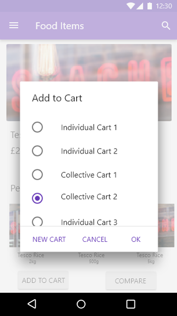
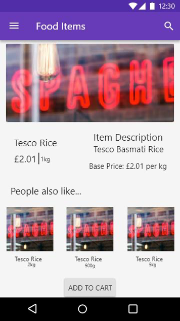
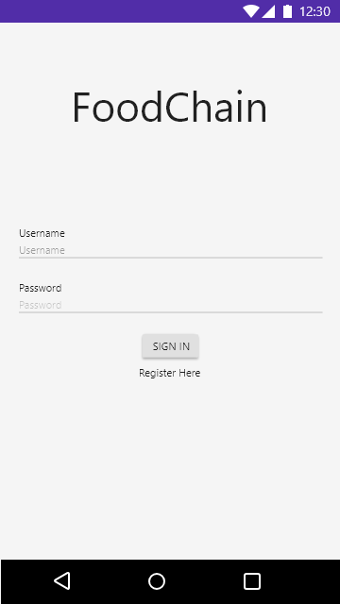
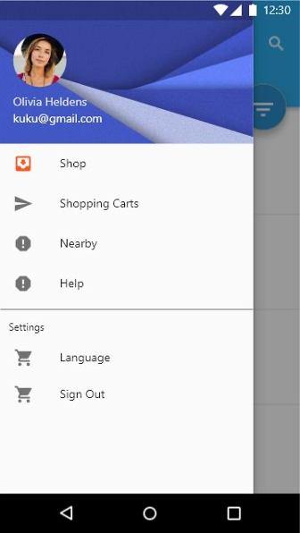
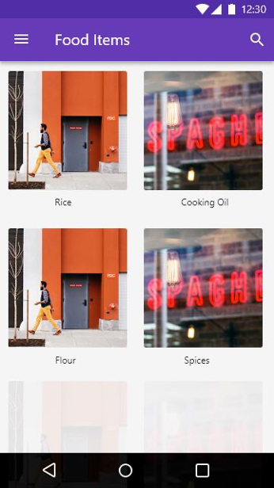

# FoodChain

Dissertation project for Newcastle University - developed a Xamarin Studio application for devices running Android 4.4+ with Parse Platform as NoSQL data backend.

Project proposal added to the root directory of the project.

## Screenshots

</img>
</img>
</img>
</img>
</img>
